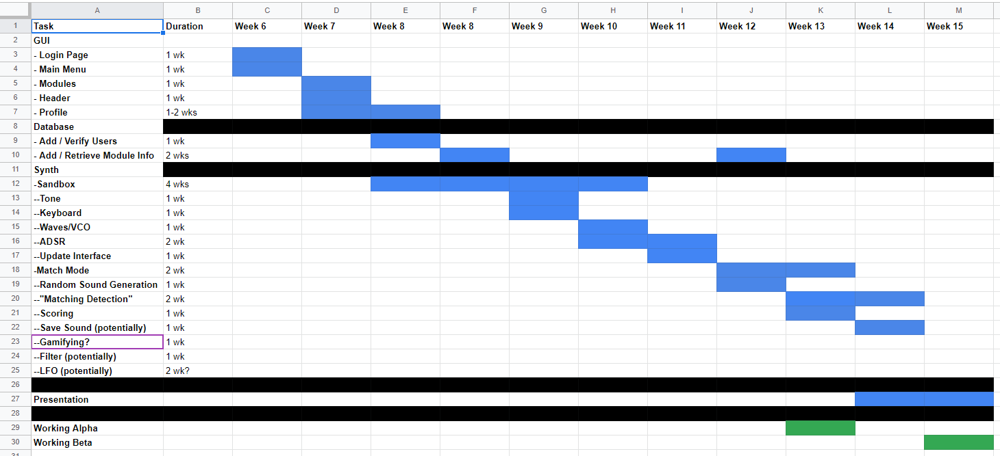

# **4.0** - Software Development Plan

- [**4.0** - Software Development Plan](#40---software-development-plan)
  - [**4.1** - Plan Introduction](#41---plan-introduction)
    - [**4.1.1** - Project Deliverables](#411---project-deliverables)
  - [**4.2** - Project Resources](#42---project-resources)
    - [**4.2.1** - Hardware Resources](#421---hardware-resources)
    - [**4.2.2** - Software Resources](#422---software-resources)
  - [**4.3** - Project Organization](#43---project-organization)
  - [**4.4** - Project Schedule](#44---project-schedule)
    - [**4.4.1** - PERT / GANTT Chart](#441---pert--gantt-chart)
    - [**4.4.2** - Task / Resource Table](#442---task--resource-table)
    - [**4.4.3** - Class Schedule](#443---class-schedule)

## **4.1** - Plan Introduction

### **4.1.1** - Project Deliverables

Our project proposal can be found [here](Project%20Proposal.pdf).

Our project proposal presentation can be found [here](Project%20Proposal%20Presentation.pdf).

Feedback on our presentation can be found [here](proposal-feedback.txt).
```
Evaluation and Feedback
CMSI 401 project ~~ Fall 2020
Jeremy Goldberg, Alvin Lai, David Sackler, Andrey Varakin
Synth Trainer project
=================================
Presentation:
   a lovely job on the presentation!  you all knew your parts and you spoke
   authoritatively about your project and what it can do.  ADSR envelopes are
   a great way to train your ear to recognize different sounds.  I've played
   with MiniMoog, Korg, and Arp synthesizers, and they have SO MUCH sonic
   capacity ~ you can make any sound with them!  the graphics in the slides
   were great, and show ADSR functionality quite clearly.  you also gave us
   a good idea of what you have planned and included extensions.  you did a
   great job on this.

Proposal Document:
   your proposal document is well-executed and very clear.  I'm really looking
   forward to this project's successful completion and demonstration!

=============================================================================
Great work on this presentation and proposal!

your score:  5% out of 5% which is an A-plus

```

## **4.2** - Project Resources

### **4.2.1** - Hardware Resources

### **4.2.2** - Software Resources

## **4.3** - Project Organization

## **4.4** - Project Schedule

### **4.4.1** - PERT / GANTT Chart
Please refer to our GANTT chart [here](GANTT_Chart.xlsx).



### **4.4.2** - Task / Resource Table

### **4.4.3** - Class Schedule
Please refer to our class schedule [here](http://bjohnson.lmu.build/cmsi401web/classnotes.html).

[This](http://bjohnson.lmu.build/cmsi401web/overview.html) is the link to the overview of the class.
